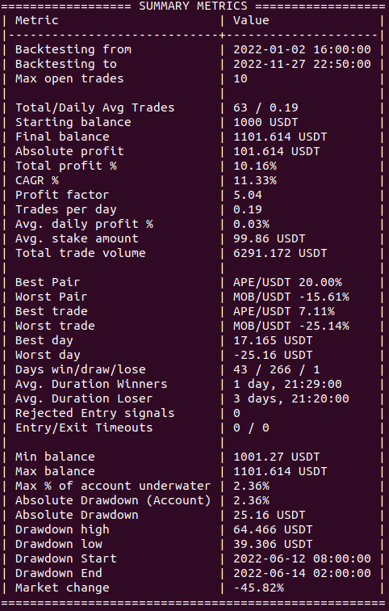
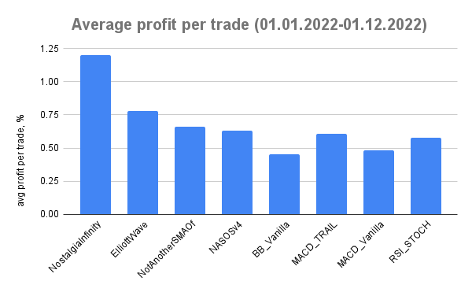

# Data science LTAT.02.002 project

Team members:
- Dāvis Krūmiņš
- Audris Mihailovs

Hello! Our project was to study the crypto trading market, more specifically, automated software trading. Crypto exchanges provide API's to automatically buy or sell a desired currency. Freqtrade is an open-source trading bot written in python that allows one to write their own trading strategy. It can be whatever one desires, check weather API to see if there is rain -> don't buy, check whether the Unix timestamp is a primenumber -> buy .. etc. But it would be beneficial if there was some science behind trading decisions (as if markets are not a black box, hah), so traders usually work with historical price data to make *informed* decisions on what the potential price trend is.

The usual trading algorithm involves pulling the latest price data (we used 5m candles, meaning that traders get to know price updates every 5 minutes of how much was bought, sold etc.), then you can choose how big of a weight to give to the latest data, and pick the range from the dataframe.

After much researching of how different ways the same data can be shuffled and trampled with [technical analysis](https://www.investopedia.com/terms/t/technicalanalysis.asp) tools, we decided to try implementing a strategy of our own. As we are only beginners we were curious what strategies the community that has been doing automated trading for decades has mastered. We thought it interesting to compare the results of our basic strategy to that of more advanced, machine-learning, overall market-movement respecting, volume accounting strategies, and see the performance.

## Custom strategies: 
1. MACD_Vanilla:
- employs Moving Average Convergence Divergence

2. MACD_trailing
- MACD with Commodoity Channel

3. BB_Vanilla
- Standard deviations from moving average, basically looking for sharp turns [BB](https://www.investopedia.com/terms/b/bollingerbands.asp)

4. RSI_STOCH
- [Relative Strength Index](https://www.investopedia.com/terms/r/rsi.asp) + [Stochastic Oscillator](https://www.investopedia.com/terms/s/stochasticoscillator.asp)

## Comparison strategies:
- NostalgiaForInfinityX - [hyperopt beast](https://github.com/iterativv/NostalgiaForInfinity)
- Elliot Oscillator
- Moving average offset
- NASOv4 - bunch of things included (RSI, Elliot, moving averages, custom stoploss etc.)

# Results

Backtesting results were promising, especially after hyperoptimizing for the specific period.

*Ok, this doesn't even beat the inflation, let's be honest.*

But of course it's always easy to look back and know what would have been best. Live trading is different sort of thing entirely.
We ran the same strategies that looked decent with historical data for 3 weeks 24/7 in the cloud, but the results did not live up the expectations...

Either way we found that despite our strategies are not a match for veterans, they did not lag that far behind, signifiying the randomness currently going on the crypto world after FTX, and no matter what you buy most of it goes down during the bearish trend we are experiencing. Sell you crypto and buy TSLA, let's go

